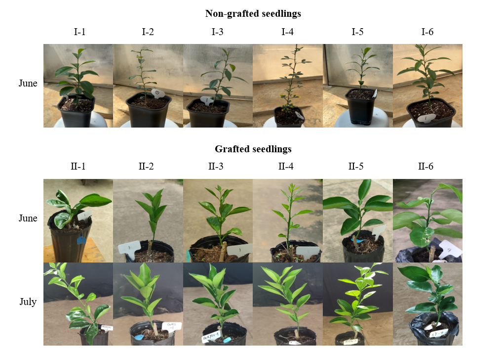
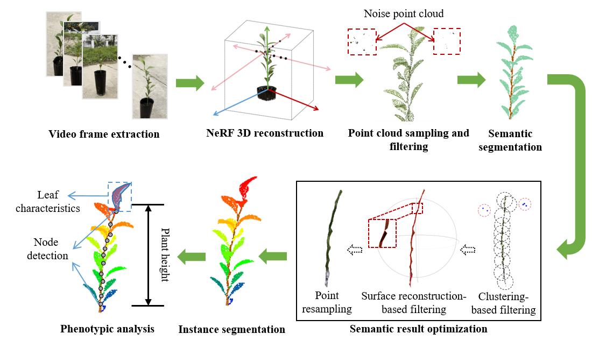
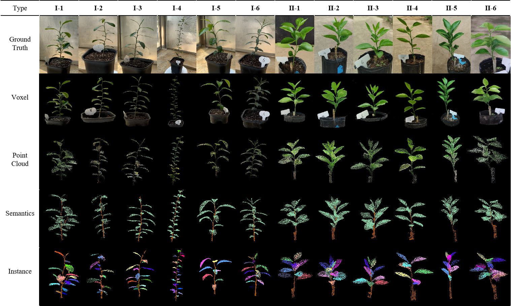

## 📖 Accurate and Convenient 3D Phenotyping for Citrus Enabled by Neural Radiance Fields-based Reconstruction

🔥 A well-labelled spatiotemporal dataset. ⭐ The pipeline to refine plant point clouds sampled from artifact-associated NeRF models. 🔥 A two-step strategy for organ segmentation in complicated plant structures

> Paper(Update after receiving)

> Liang Zhao, Lin Ruan, Gang Hu, Qiang Xu, Xia Wang, Hong Chen, Shanjun Li6, Weifu Li, Yaohui Chen
> Huazhong Agricultural University

🚩 **Updates**

☑ The superior performance of the pipeline in 3D reconstruction and 3D organ segmentation.

☐ The code and data will be released after the paper's acceptance. Please stay tuned.
## Table of Contents
- [Experimental materials](#experimental-materials)
- [3D phenotyping pipeline](#3d-phenotyping-pipeline)
- [Reconstruction and segmentation results](#reconstruction-and-segmentation-results)
- [Contact](#contact)

### Experimental materials

### 3D phenotyping pipeline

### Reconstruction and segmentation results

### Contact
If you have any question or collaboration needs, please email liweifu@mail.hzau.edu.cn or yaohui.chen@mail.hzau.edu.cn.
## Acknowledgement
This study is based on [Instant-NGP](https://github.com/NVlabs/instant-ngp) as well as [PointNext](https://github.com/guochengqian/PointNeXt) and [SoftGroup](https://github.com/thangvubk/SoftGroup). We appreciate their great codes.