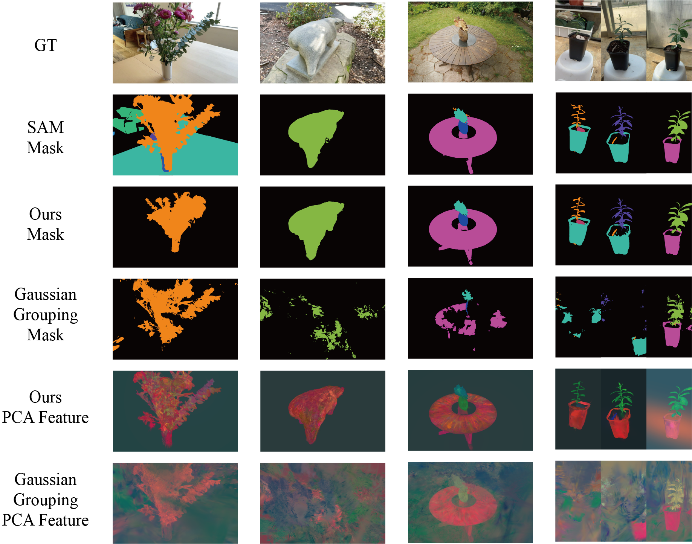
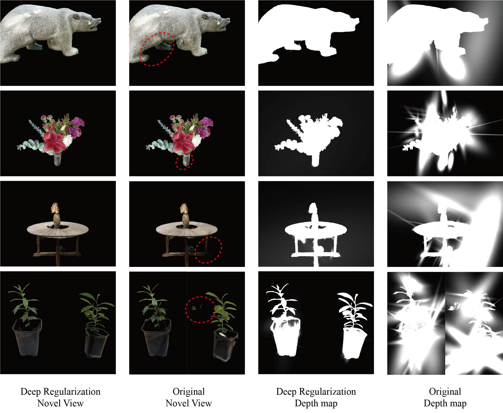

## 📖 TSGaussian: Semantic and Depth-Guided Target-Specific Gaussian Splatting from Sparse Views

🔥 2D detection, semantic segmentation, and 3D reconstruction of specific target objects;⭐ Separation of reconstructed 3D objects based on their semantic identities, enabling distinct handling of different semantic components; 🔥 High-quality 3D reconstruction and rendering in sparse-view scenarios without compromising reconstruction quality.
> Paper(Update after receiving)

> Liang Zhao, Zehan Bao, Yi Xie, Hong Chen, Yaohui Chen, Weifu Li

> Huazhong Agricultural University

🚩 **Updates**

☑  We develop an algorithm that extends high-performing 2D scene understanding techniques to the 3D domain in sparse views.

☐ The code and data will be released after the paper's acceptance. Please stay tuned.
## Table of Contents
- [Consistent Targeted Semantic Segmentation](#consistent-targeted-semantic-segmentation)
- [Semantic Constraints for 2D-to-3D](#semantic-constraints-for-2d-to-3d)
- [Multi-Scale Depth Regularization](#multi-scale-depth-regularization)
- [Contact](#contact)

### Consistent Targeted Semantic Segmentation

### Semantic Constraints for 2D-to-3D

### Multi-Scale Depth Regularization

### Contact
If you have any question or collaboration needs, please email liweifu@mail.hzau.edu.cn.
## Acknowledgement
This study is based on [gaussian-grouping](https://github.com/lkeab/gaussian-grouping) as well as [DNGaussian](https://github.com/Fictionarry/DNGaussian). We appreciate their great codes.